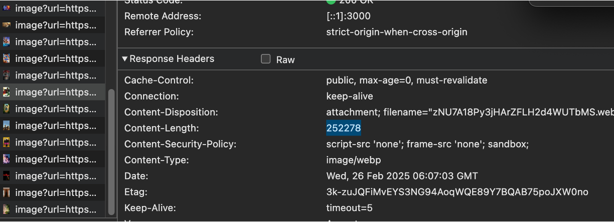
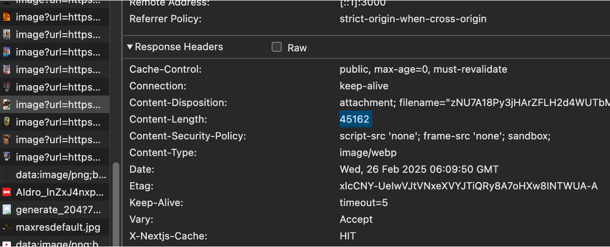
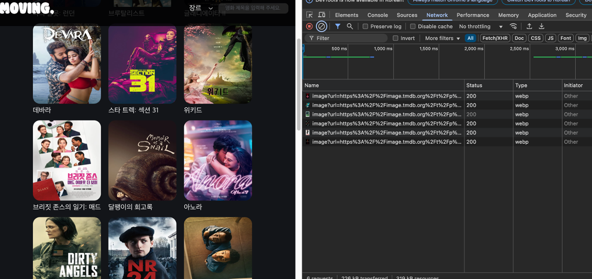

  

  

**최신 영화 예고편과 관련 정보를 볼수 있는 OTT플랫폼**  
TMDB API를 이용한 OTT서비스로 카테고리별 영화 추천과 검색이 가능합니다.
 
영화별 연관된 추천 영화, 출연진, 스토리 등 간단한 영화 정보를 조회 하실수 있습니다.

---

> 
사이드 프로젝트   2024.11.18 ∼ 2024.12.10

<h3>배포 사이트</h3>
https://moving-project-ott.vercel.app/🔗

 
 

## 📚 기술 스택

  

## 📌 프로젝트 소개

MOVING에서 추천하는 영화 목록을 확인할수 있습니다.
 
 
TMDB 오픈 API를 통해 영화의 각종 정보와 유튜브 key를 통해 예고편을 불러와 메인 베너에서 확인할 수 있습니다.
axios와 React Query를 통한 데이터 패칭과, pramer motion을 통한 애니메이션 효과로 부드러운 사용성, next/Image컴포넌트를 통한 이미지 최적화 작업을 중심으로 구현하였습니다.

  

## 📌 트러블 슈팅

[문제]
 

- 이미지 처리 부분에서 비효율성과 과도한 리랜더링으로 인해 페이지 성능 저하

[원인]

- 반응형을 위해 image속성에 fill을 적용 하였지만 사이즈 지정이
  되어있지 않아서 최적화된 이미지 용량으로 가져오지 못함
- 비동기적으로 동영상과 이미지를 가져오면서 로딩중 해당 영역이
  없어지며 CLS문제가 발생함
- 모든 이미지를 한번에 불러와 성능 부담 증가

[해결]

- fill 속성과 size속성을 추가하여 이미지 용량을 최적화해 1/10로
  이미지 용량 감소

  > 이미지 원본 사이즈로 데이터 로딩
  > 
  > size속성 적용 후
  > 

- 로딩시 스켈레톤 UI 적용으로 대규모 레이아웃 이동을 방지하고
  CLS를 개선하여 더 부드러운 인터랙션을 제공.
  
- lazyLoading을 적용해 메모리 사용 최적화와 초기 로딩 속도를
  개선(스크롤시 데이터 추가로 불러옴)
  

   

## 🙍‍♂️ 팀원 소개

| 이름   | 상세 내용                                                   |
| ------ | ----------------------------------------------------------- |
| 장용한 | 기획, 메인 페이지, 장르별 카테고리 페이지, 검색 페이지 구현 |
| 염정훈 | 기획, 상세 모달 페이지, 동영상 재생페이지                   |
| 최원혁 | 기획, 웹디자인 및 와이어프레임, 랜더 페이지                 |
